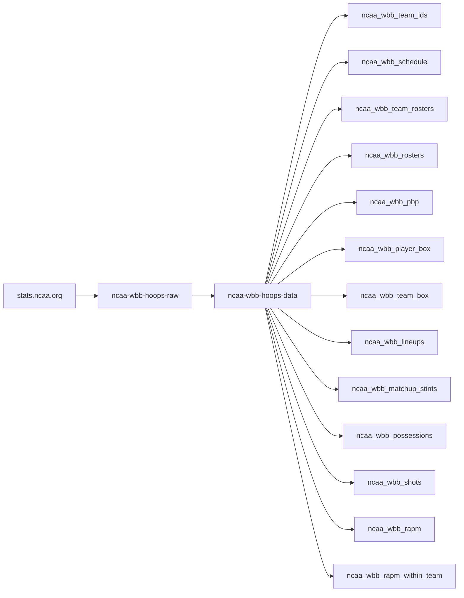
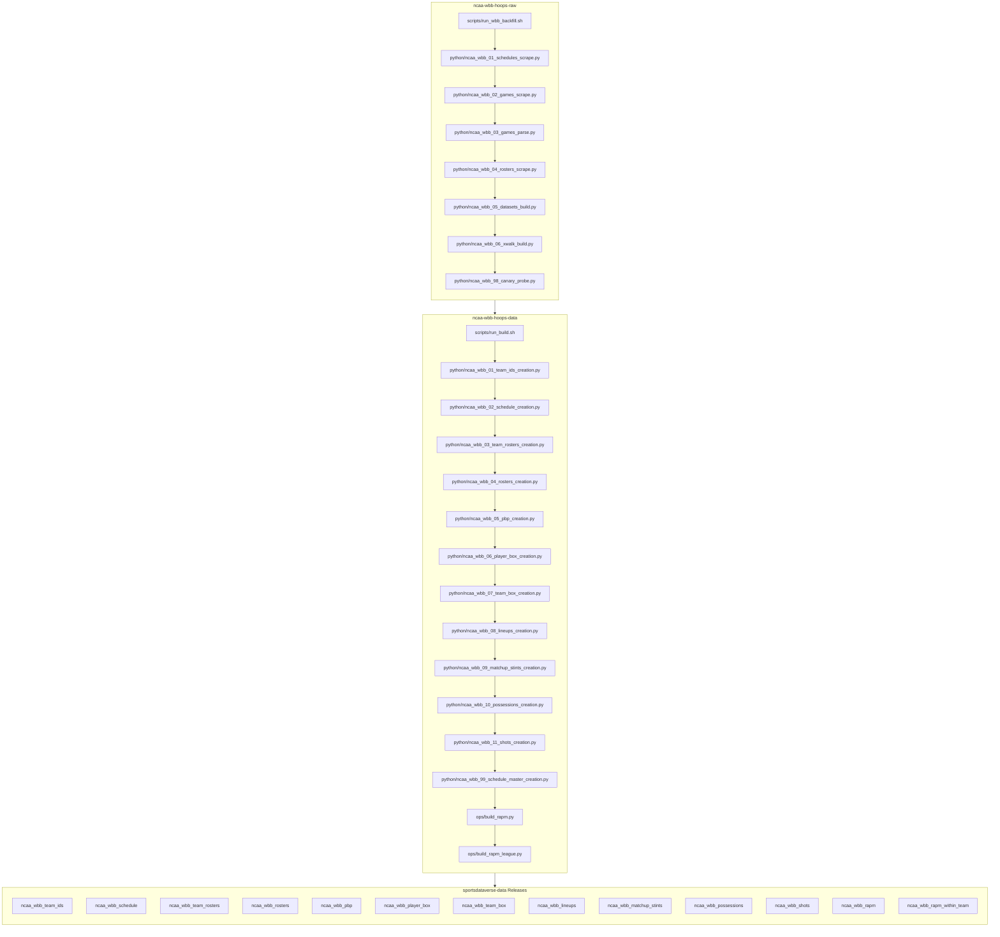

# ncaa-wbb-hoops-data

Python producer that reshapes [`ncaa-wbb-hoops-raw`](https://github.com/sportsdataverse/ncaa-wbb-hoops-raw)'s
parsed `stats.ncaa.org` women's basketball JSON into season-level tidy datasets.
The upstream source is `stats.ncaa.org` (via the bigballR/wbigballR port in
sdv-py) -- **not** ESPN; NCAA contest ids are strings, not ESPN ints. Sister
repo to the wehoop (WNBA) and hoopR (NBA/MBB) data producers -- same
build -> publish shape, different sport/league; a retarget of
[`ncaa-mbb-hoops-data`](https://github.com/sportsdataverse/ncaa-mbb-hoops-data).

## ncaa-wbb-hoops workflow diagram





`scripts/run_wbb_backfill.sh` (raw) and `scripts/run_build.sh` (data) are the
drivers; `run_autocommit.sh` commits captures as they land. Stage numbers are
intended build order, not run order. WBB is HALVES before season 2016; the
quarters model silently empties those seasons.

[wehoop-wbb-raw repository (source: ESPN)](https://github.com/sportsdataverse/wehoop-wbb-raw)

[wehoop-wbb-data repository (source: ESPN)](https://github.com/sportsdataverse/wehoop-wbb-data)

[wehoop-wnba-raw repository (source: ESPN)](https://github.com/sportsdataverse/wehoop-wnba-raw)

[wehoop-wnba-data repository (source: ESPN)](https://github.com/sportsdataverse/wehoop-wnba-data)

[wehoop-wnba-stats-raw repository (source: WNBA Stats)](https://github.com/sportsdataverse/wehoop-wnba-stats-raw)

[wehoop-wnba-stats-data repository (source: WNBA Stats)](https://github.com/sportsdataverse/wehoop-wnba-stats-data)

[ncaa-wbb-hoops-raw repository (source: stats.ncaa.org)](https://github.com/sportsdataverse/ncaa-wbb-hoops-raw)

[ncaa-wbb-hoops-data repository (source: stats.ncaa.org)](https://github.com/sportsdataverse/ncaa-wbb-hoops-data)

## Datasets

Eleven datasets, keyed in `config.REGISTRY`. Six are DIRECT extracts of a
top-level key in each game's parsed JSON; the other five are DERIVED — built
from those same parsed payloads, from the raw roster files, or from the
crosswalk, rather than from one named family.

Listed in stage order. That order is `config.REGISTRY` insertion order, which
`--dataset all` iterates, so it is also the order a full build runs in:
identity/reference frames first, then per-game events and box, then the
lineup-grain frames. It is a **reading order, not a dependency chain** — no
dataset is built from another dataset's OUTPUT, so any one can be built alone
in any order (`--dataset shots` works on its own).

| NN | dataset | type | description |
| --- | --- | --- | --- |
| 01 | `team_ids` | derived | stats.ncaa.org team-id crosswalk for the season, from the bundled sdv-py `ncaa_wbb_team_ids` table. Reads no games at all. |
| 02 | `schedule` | derived | One row per game (home/away/date/final score). Built from each payload's `pbp` **family** — the parsed JSON has no schedule family. |
| 03 | `team_rosters` | derived | Per-team season rosters, read from the raw repo's captured roster JSON (not from a parsed-game family). |
| 04 | `rosters` | derived | Distinct `(team, player)` pairs per season with a games-played count. Built from each payload's `player_box` **family**, because the parsed tree has no roster family and sdv-py's roster parser needs roster HTML this tree doesn't hold. |
| 05 | `pbp` | direct | Play-by-play, one row per event. |
| 06 | `player_box` | direct | Per-player box score, one row per player/game. |
| 07 | `team_box` | direct | Per-team box score, one row per team/game. |
| 08 | `lineups` | direct | On-court five-man units by stint. |
| 09 | `matchup_stints` | derived | One row per constant-10-man floor segment, with score/possession deltas. `home_lineup_key`/`away_lineup_key` join to `lineups.lineup_key`. |
| 10 | `possessions` | direct | Possession-level rollup. |
| 11 | `shots` | direct | Shot events with location. |
| 99 | *(schedule master)* | cross-dataset | Not a dataset — the D34 coverage index over all of the above. See below. |

Two of the reference frames read a per-game **family** rather than a dedicated
one: `schedule` from `pbp` and `rosters` from `player_box`. That is a content
lineage, not a build dependency — both re-derive from the raw payloads, so
they are still buildable before stages 05/06 ever run. They sit early because
they are dimension tables you join everything else to.

## Schedule master (stage 99)

Three committed artifacts answer "what does this repo actually have?", all
emitted in one pass by `python/ncaa_wbb_99_schedule_master_creation.py`:

| file | grain | what it is |
| --- | --- | --- |
| `wbb/ncaa_wbb_schedule_master.parquet` | one row per contest | **Denominator** — every contest stats.ncaa.org lists, including ones nothing was built from. |
| `wbb/ncaa_wbb_games_in_data_repo.parquet` | one row per contest | **Numerator** — only contests present in ≥1 dataset. Join consumer work against this one. |
| `wbb/ncaa_wbb_schedule_coverage.parquet` | one row per season | Game count, date span, and `pct_in_*` per dataset. |

The denominator comes from the **raw** repo's `wbb/wbb_schedule_master.parquet`
(D33), not from the built `schedule` dataset — that one is derived from `pbp`,
so using it would make coverage 100% by construction. Each `in_*` flag is
stamped from the committed per-season parquet of that dataset, and the flag SET
is derived from `config.REGISTRY` (`level == "game"`), never hand-listed.

**Current WBB state: the capture campaign is COMPLETE.** The raw repo holds
93,884 captured and parsed contests over 2010-2026 (99.83% of the
94,042-contest denominator; the 158 stragglers are pageless/cancelled contests
with no game page). All eleven datasets are built for all 17 seasons and
published -- 178 units x 3 formats = 534 release assets. Re-run stage 99 after
any rebuild so the coverage index matches the tree.

```bash
NCAA_WBB_RAW_ROOT=../ncaa-wbb-hoops-raw \
  uv run python python/ncaa_wbb_99_schedule_master_creation.py
```

## Run order

1. **Build** -- reshapes the raw JSON and writes parquet in-repo under
   `wbb/{dataset}/parquet/ncaa_wbb_{dataset}_{season}.parquet` (committed).
2. **Publish** -- uploads parquet + csv.gz + rds as release assets to
   `sportsdataverse/sportsdataverse-data` (not committed; requires `gh` auth).
3. **Stage 99** -- after the seasons are built, rebuild the schedule master so
   the coverage index matches the tree.

```bash
# Build all 11 datasets for a season
uv run python -m ncaa_wbb_data_build build --dataset all --season 2025

# Build one dataset
uv run python -m ncaa_wbb_data_build build --dataset shots --season 2025

# Build + publish (uploads release assets)
uv run python -m ncaa_wbb_data_build build --dataset all --season 2025 --publish
```

Or the launcher scripts, which set up logging and the raw-root env:

```bash
SEASON=2025 bash scripts/run_build.sh
SEASON=2025 DATASET=shots bash scripts/run_build.sh   # single dataset

SEASON=2025 bash scripts/run_publish.sh                # build + publish
```

For the **whole history** rather than one season, use the historical driver.
It builds and publishes every season of every dataset, newest-first:

```bash
bash scripts/run_historical_publish.sh                 # 2010..2026, all datasets
START=2015 END=2010 bash scripts/run_historical_publish.sh
DATASETS="pbp shots" bash scripts/run_historical_publish.sh
DRY_RUN=1 bash scripts/run_historical_publish.sh       # build + stage, no uploads
```

It is resumable, **and its resume proves a PUBLISH**: a (dataset, season) is
skipped only when the release actually holds its parquet + csv, never on the
strength of a local parquet or a manifest row (`io.write_dataset` upserts the
manifest *before* the upload runs, so a failed upload otherwise looks done
forever). The index costs one `gh` call per tag, and the sweep ends by
re-auditing what actually landed:

```bash
python -m ncaa_wbb_data_build check              # built vs published, per dataset
python -m ncaa_wbb_data_build check --porcelain  # "<dataset> <season>" per published unit
```

Watch a run live with `tail -f logs/historical_publish_<timestamp>.log`.

`NCAA_WBB_RAW_ROOT` points at the sibling `ncaa-wbb-hoops-raw` checkout (the
launchers default it to `../ncaa-wbb-hoops-raw`); an HTTP fallback is used
when that checkout isn't available locally.

## Input contract

This repo consumes the output of the Phase-1 raw scraper,
[`ncaa-wbb-hoops-raw`](https://github.com/sportsdataverse/ncaa-wbb-hoops-raw):

- `wbb/json/{contest_id}.json` -- per-game parsed payload (the 7-key dict
  `contest_id`/`pbp`/`lineups`/`player_box`/`team_box`/`shots`/`possessions`).
- `wbb/wbb_schedule_master.parquet` -- the season contest-id index (`contest_id`,
  `season` as Utf8 ending-year, `captured`).

`contest_id` is a NCAA string id (not an ESPN int) and stays `Utf8`
everywhere in this package -- never cast to `Int64`.

**The Phase-1 backfill has run** (2026-08-18): 93,884 contests captured and
parsed across 2010-2026, and every dataset built and published from them. The
4-game hermetic fixture under `tests/fixtures/raw_root/wbb/` (season 2025)
remains for offline tests. Running `run_build.sh`
against a real `NCAA_WBB_RAW_ROOT` today will only produce whatever games
that checkout happens to have captured.

## Format policy

- **parquet**: committed in-repo under `wbb/{dataset}/parquet/` as
  `ncaa_wbb_{dataset}_{season}.parquet`, always written on every build.
  The `ncaa_wbb_` prefix matches the release tag, so a downloaded asset keeps
  its provenance in the filename instead of colliding with every other
  league's `pbp_2026.parquet`.
- **parquet + csv.gz + rds**: published as release assets to
  `sportsdataverse/sportsdataverse-data`, tagged `ncaa_wbb_{dataset}` (e.g.
  `ncaa_wbb_pbp`). Uploaded one file at a time via
  `gh release upload <tag> <file> --repo sportsdataverse/sportsdataverse-data --clobber`,
  creating the release if it doesn't exist yet. csv/rds are staged under the
  gitignored `wbb/_release_build/` and are re-derivable from the committed
  parquet -- they are never committed.
- **The release csv is GZIPPED (`.csv.gz`), deliberately.** Measured on the MBB
  twin, whose tree is fully built: one season of `pbp` is ~3.1M rows and writes
  a **2,126,337,961-byte** plain csv -- 99.0% of GitHub's 2 GiB
  (2,147,483,648-byte) per-asset hard limit, so a season slightly longer would
  fail to upload outright. Gzipped it is **99,701,928 bytes (~95 MiB)**, 21.3x
  smaller. `espn_cfb_model_pbp` already ships `.csv.gz` on the same release
  repo. Read one with `pl.read_csv(gzip.open(path, "rb"))`, or
  `readr::read_csv()` in R, which decompresses transparently.
- **The `ncaa_wbb_*` releases are live** on `sportsdataverse/sportsdataverse-data`
  (11 tags, one per dataset), first published 2026-08-18 by
  `scripts/run_historical_publish.sh` over the completed 2010-2026 capture.
  Run `python -m ncaa_wbb_data_build check` for the current built-vs-published
  state rather than trusting this line.
- **rds** requires R with the `arrow` package (`Rscript` shells out to
  `arrow::read_parquet` -> `saveRDS`). Resolution order: `SDV_RSCRIPT` env,
  then `RSCRIPT` env, then `Rscript` on `PATH`, then a scan of
  `C:/Program Files/R/R-*/bin/Rscript.exe`. **R 4.5.3 has `arrow`; R 4.6.0 does
  not** (as of this writing) -- point `SDV_RSCRIPT` at an arrow-capable
  install if the default resolution picks the wrong one. RDS conversion
  failure (e.g. no R install has `arrow`) only logs a warning -- it never
  blocks the parquet+csv upload.

## Requirements / credentials

- [`uv`](https://docs.astral.sh/uv/) for everything -- never bare `python`/`pip`.
- The `sportsdataverse` dependency resolves to the local `../../sdv-py`
  sibling checkout (editable, `[tool.uv.sources]` in `pyproject.toml`): NCAA
  parsers aren't on PyPI yet. Swap to the PyPI pin in `pyproject.toml` once a
  release ships NCAA support.
- Publishing needs `gh` authenticated with a token: `GH_TOKEN`, `GITHUB_PAT`,
  or `SDV_GH_TOKEN` (checked in that order; `run_publish.sh` also falls back
  to `~/.Renviron`, then `~/Documents/.Renviron`).
- RDS conversion needs an R install with `arrow` on `PATH` (or `SDV_RSCRIPT`
  pointed at one) -- see the format-policy note above on the R 4.5.3 vs 4.6.0
  split.

## Tests

Hermetic, offline, no network: 4 real fixture games under
`tests/fixtures/raw_root/wbb/json/` plus a `wbb_schedule_master.parquet`
for season `2025`. `team_ids` reads the bundled sdv-py crosswalk, so it's
offline too.

```bash
uv run pytest -q
```

`tests/test_e2e.py` builds all 11 datasets from the fixtures into a temp
directory and asserts each parquet is written, non-empty, schema-stable
across the write/read round-trip, and holds the dtype-discipline contract
(`contest_id`/`id` as Utf8, `season` as Int64 == 2025). Season is pinned to
2025 because the committed fixtures are season-2025 games -- see "Season
coverage" above.

## sdv-py loader wiring (deferred)

Wiring these datasets into sdv-py's `wbb_loaders` is a follow-up task, done
*after* the first real publish. The loader introspects the live published
parquet's footer schema, so it can't be generated until a real `ncaa_wbb_*`
release exists on `sportsdataverse/sportsdataverse-data`.

## Player name changes (`wbb/name_changes/`)

stats.ncaa.org re-renders roster and box pages with a player's **current** name,
while the play-by-play preserves the name **as it was at game time**. A player
who changes their name therefore never matches between `possessions` and
`team_rosters`, in any season, and no safe string rule bridges
`KATELYNN.LIMARDO -> KATELYNN.MARTIN`.

The `box_score` page binds both renderings to one numeric player id:

```text
shot JS   addShot(..., '... player_768547579 team_201', ...)
          "made by Miah Monahan(Eastern Ill.)"      <- game-time
dropdown  <option value="768547579">Miah Meyer      <- current
```

`ops/build_name_changes.py` extracts that binding across the whole raw tree:

```sh
python ops/build_name_changes.py --league wbb
```

~3 minutes over 93,884 games -> 658 name-changes, written to
`wbb/name_changes/parquet/ncaa_wbb_name_changes.parquet`
(`season`, `team`, `name_game_time`, `name_current`, `n_games`).

**Known gap: 2019+ only.** The binding is the shot-chart JS, and shot charts
start in 2019 -- the same boundary that makes `shots` a 2019+ dataset. Earlier
seasons still benefit where a career spans the boundary (WBB 2018 +2.06pp,
2017 +0.72pp of fully-resolved possessions), but 2016 and older gain nothing.

Only rows whose two **coded** names differ are emitted; comparing raw HTML
strings yields false positives from entity/whitespace noise.

**Not yet a published dataset** -- it is a committed artifact consumed by the
sdv-py RAPM identity layer. Registering it in `config.REGISTRY` (and so on a
release tag) is a separate decision.

## RAPM (`ops/build_rapm.py`)

Feeds the hoop-explorer RAPM engine (`sportsdataverse.mbb.mbb_rapm`) from the
raw HTML. The engine consumes ES-derived lineup buckets -- 257 keys each --
which **no published dataset carries** (`possessions` is 56 flat columns,
`lineups` 77), so the buckets come from the chain that produces them:

```text
get_box_lineup -> create_lineup_data -> lineup_stats_buckets
  -> lineup_to_team_report -> build_player_context
  -> calc_player_weights / calc_lineup_outputs / slow_regression -> calculate_rapm
```

The call sequence is copied from sdv-py's committed end-to-end test, so the
bucket shape is right by construction rather than inferred.

```sh
uv run python ops/build_rapm.py --league wbb --season 2024 --workers 8
```

### Publishing it (`ops/publish_rapm.py`)

Stage 3. `build_rapm.py` emits a frame keyed on team plus a DISPLAY name; the
publisher attaches `season` / `team_id` / `player_id` / `person_id` and uploads
the `ncaa_wbb_rapm_within_team` release dataset via `sportsdataverse.release`.

```sh
# dry run (default) -- runs the full join and enforces the floor, uploads nothing
uv run python ops/publish_rapm.py --league wbb --rapm-dir ops/out

# publish
uv run python ops/publish_rapm.py --league wbb --rapm-dir ops/out --publish
```

**The estimand is WITHIN-TEAM**, not league-wide -- the tag name says so, and
`ncaa_wbb_rapm` stays free for a future league-wide (Path B) dataset.

Publishing is gated: a 99% id match-rate FLOOR that `--min-match-rate` may raise
but never lower, and a hard refusal when the name-change crosswalk is missing
(without it a renamed player silently becomes two `person_id`s and the match
rate cannot detect it). Ambiguity is nulled, never guessed.

Note `sportsdataverse_save` uploads but never CREATES a release -- the tag must
exist first (`gh release create`).

Each build also writes `ncaa_wbb_rapm_<season>.manifest.json` recording what the run actually
covered (partial flag, team/limit, games_processed vs games_available, teams
rated, rows). The publisher REFUSES a season whose manifest is missing, marks it
partial, shows a truncated run, or disagrees with the parquet's row count.

The filename suffix only proves a run was *declared* partial; it cannot prove a
run that claimed to be full actually finished. An interrupted full run writes
the canonical name with fewer teams and still clears the match-rate floor.

`--allow-unmanifested` covers the pre-manifest corpus only. It waives the proof
rather than supplying one, and never silences a manifest that says PARTIAL or
TRUNCATED.

~0.51 s/game single-threaded; 8 workers does a season in ~9 min.

**D-I scoping is on by default and is not cosmetic.** Rating every team that
appears on the floor wrecks the distribution, because non-D-I exhibition
opponents play one or two tracked games each:

| scope | n | mean | sd | max abs |
| --- | --- | --- | --- | --- |
| all teams | 5,836 | -1.85 | 5.07 | 33.3 |
| **D-I only** | **4,081** | **-0.16** | **2.18** | **9.4** |
| non-D-I | 1,755 | -6.08 | 6.98 | 33.3 |

D-I alone centres at ~0 with sd 2.18 -- the shape RAPM should have -- and the
leaderboard resolves to real elite players (Brink, Cardoso, Fulwiley, Ejim).
`--all-teams` disables the scope.

**This engine's RAPM is WITHIN-TEAM**: it apportions one team's performance
across its own players, a different estimand from league-wide RAPM. Provisional
-- not yet oracle-gated against Torvik/KenPom, and not published.

## League-wide RAPM (`ops/build_rapm_league.py`)

The LEAGUE-WIDE estimand ("Path B") -- one joint O/D ridge per season over
all D-I possessions, published to `ncaa_{lg}_rapm` (the within-team dataset
above is a different estimand and a different tag; every league row carries
`estimand="league"`). Reads this repo's published `possessions` +
`team_rosters` + `name_changes` trees and the sdv-py modules
`mbb_ncaa_rapm_input` (identity) + `mbb_ncaa_rapm_league` (stints + solver;
league-blind -- WBB passes its own frames).

```sh
# stages 1-2: build + gates + completion manifest (per season or --all)
uv run python ops/build_rapm_league.py --league mbb --season 2024
uv run python ops/build_rapm_league.py --league mbb --all

# stage 3: dry run (default) revalidates every manifest; --publish uploads
uv run python ops/publish_rapm_league.py --league mbb
uv run python ops/publish_rapm_league.py --league mbb --publish
```

Publishing is gated, floors frozen from the observed 2026-08-24 validation
sweep and NEVER lowered (`--min-spearman` may only raise): usable-possession
fraction >= 0.65 (this is what excludes the degenerate 2010 corpus),
intercept/HCA era bands (Spearman is scale-blind), and the external Torvik
team-aggregate gate -- Spearman(team_net, adjem) >= 0.93 (mbb) / 0.89 (wbb)
on >= 250 joined teams against `ops/oracle/ncaa_{lg}_torvik.parquet`
(provenance in `ops/oracle/README.md`). WBB 2011-2020 have no Torvik
women's oracle and publish via the explicit `UNGATED_SEASONS` allowlist
(internal gates still enforced). A failed season writes NOTHING; the
publisher refuses any season whose manifest is missing, gate-failed, or
inconsistent with the parquet (`check_run_manifest` + the league-gate
record), and enforces a median gated-Spearman >= 0.95 across the publish set.

## Automation & status

<!-- BEGIN GENERATED: status -->

| workflow | schedule | last run |
|---|---|---|
| [](https://github.com/sportsdataverse/ncaa-wbb-hoops-data/actions/workflows/orphan_scripts.yml) | on push / PR / dispatch | 2026-08-28 |
| [](https://github.com/sportsdataverse/ncaa-wbb-hoops-data/actions/workflows/tests.yml) | on push / PR / dispatch | 2026-08-24 |

| release tag | assets | size | last publish |
|---|---:|---:|---|
| [`ncaa_wbb_lineups`](https://github.com/sportsdataverse/sportsdataverse-data/releases/tag/ncaa_wbb_lineups) | 51 | 777.8 MB | 2026-08-20 |
| [`ncaa_wbb_matchup_stints`](https://github.com/sportsdataverse/sportsdataverse-data/releases/tag/ncaa_wbb_matchup_stints) | 51 | 467.5 MB | 2026-08-20 |
| [`ncaa_wbb_pbp`](https://github.com/sportsdataverse/sportsdataverse-data/releases/tag/ncaa_wbb_pbp) | 51 | 3,222.3 MB | 2026-08-18 |
| [`ncaa_wbb_player_box`](https://github.com/sportsdataverse/sportsdataverse-data/releases/tag/ncaa_wbb_player_box) | 51 | 418.6 MB | 2026-08-18 |
| [`ncaa_wbb_possessions`](https://github.com/sportsdataverse/sportsdataverse-data/releases/tag/ncaa_wbb_possessions) | 51 | 732.2 MB | 2026-08-18 |
| [`ncaa_wbb_rapm`](https://github.com/sportsdataverse/sportsdataverse-data/releases/tag/ncaa_wbb_rapm) | 52 | 10.6 MB | 2026-08-24 |
| [`ncaa_wbb_rapm_within_team`](https://github.com/sportsdataverse/sportsdataverse-data/releases/tag/ncaa_wbb_rapm_within_team) | 55 | 9.4 MB | 2026-08-24 |
| [`ncaa_wbb_rosters`](https://github.com/sportsdataverse/sportsdataverse-data/releases/tag/ncaa_wbb_rosters) | 51 | 3.1 MB | 2026-08-18 |
| [`ncaa_wbb_schedule`](https://github.com/sportsdataverse/sportsdataverse-data/releases/tag/ncaa_wbb_schedule) | 51 | 2.9 MB | 2026-08-18 |
| [`ncaa_wbb_shots`](https://github.com/sportsdataverse/sportsdataverse-data/releases/tag/ncaa_wbb_shots) | 24 | 198.1 MB | 2026-08-20 |
| [`ncaa_wbb_team_box`](https://github.com/sportsdataverse/sportsdataverse-data/releases/tag/ncaa_wbb_team_box) | 51 | 63.8 MB | 2026-08-18 |
| [`ncaa_wbb_team_ids`](https://github.com/sportsdataverse/sportsdataverse-data/releases/tag/ncaa_wbb_team_ids) | 51 | 0.2 MB | 2026-08-18 |
| [`ncaa_wbb_team_rosters`](https://github.com/sportsdataverse/sportsdataverse-data/releases/tag/ncaa_wbb_team_rosters) | 51 | 8.6 MB | 2026-08-18 |

<!-- END GENERATED: status -->
