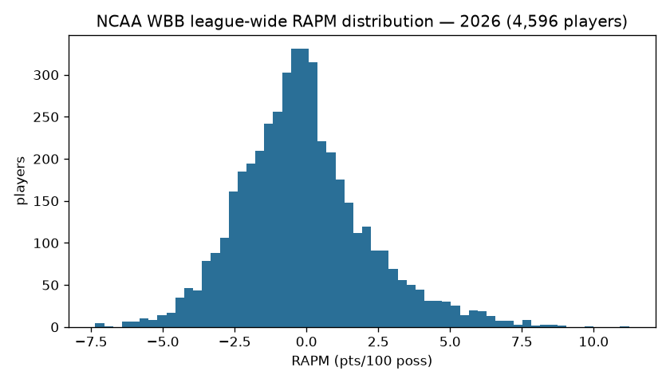
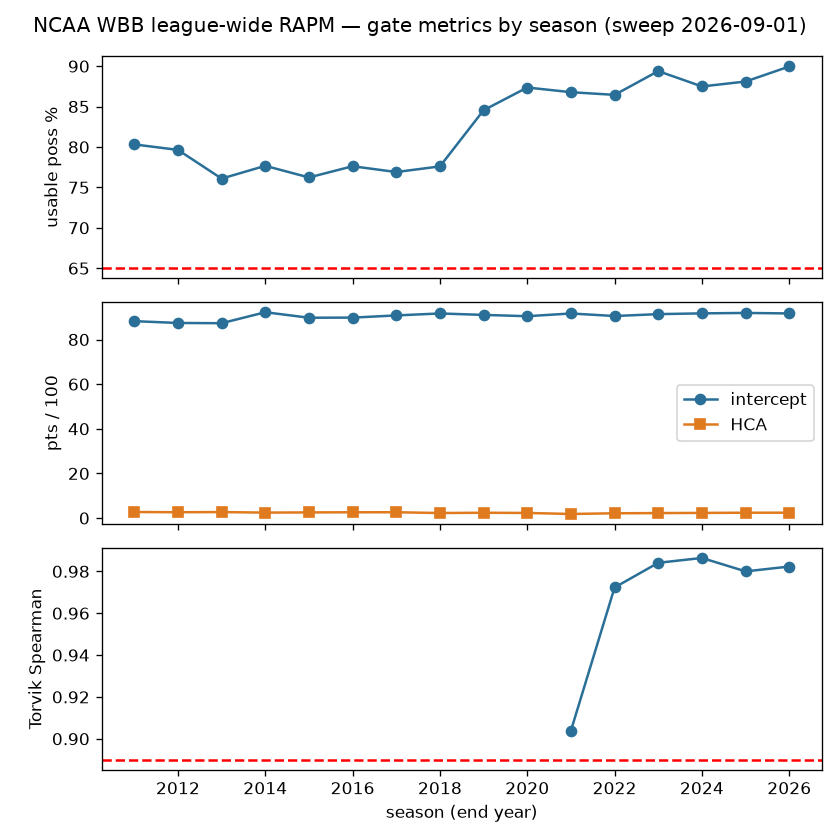
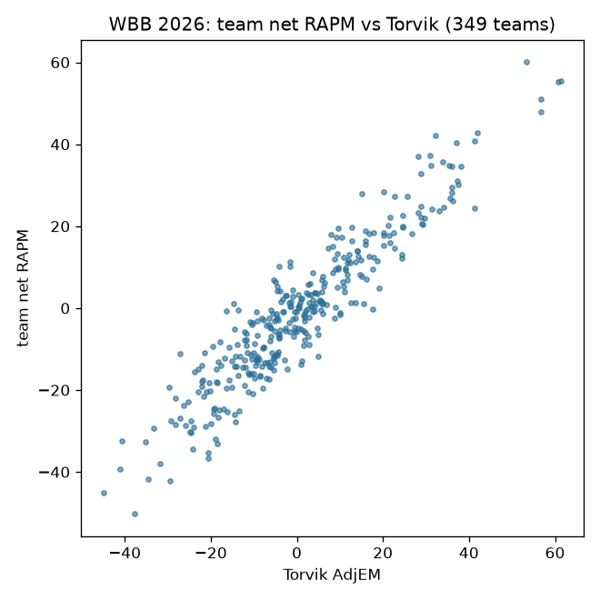

# NCAA WBB RAPM — model documentation

Two deliberately different estimands, published on separate tags (never merge):

| estimand | tag | assets | stage |
|---|---|---|---|
| League-wide (Path B — every D-I player on one scale) | `ncaa_wbb_rapm` | 52 per-season parquet | `python/ncaa_wbb_model_01_rapm_league.py` |
| Within-team (Path A — apportions one team's performance) | `ncaa_wbb_rapm_within_team` | 55 per-season parquet | `python/ncaa_wbb_model_02_rapm_within_team.py` |

## Features / design

Ridge regression (`lambda = 1000`) over the possession-level on/off design
matrix built from this repo's published `possessions` + `team_rosters` +
`name_changes` trees (league-wide) or the raw-bundle lineup reconstruction via
the sdv-py hoop-explorer engine (within-team). Seasons 2011-2026; 2010 is
excluded by the usable-possession gate, not by a season list.

## Gates + observed results (frozen from the 2026-08-24 full validation sweep)

Publish-blocking — a failed season writes NOTHING; floors may only be RAISED
(`--min-spearman` refuses lower values):

| gate | floor | observed |
|---|---|---|
| usable-possession fraction | >= 0.65 | 2011+ min 0.7609 |
| intercept era band (scale-bug catcher) | [83, 98] | 87.31-92.80 |
| home-court advantage band | [1.0, 4.0] | in-band all seasons |
| Torvik external (league-wide only) | >= 250 joined teams AND Spearman(team_net, adjem) >= 0.89 | min 0.9039 (the 2021 COVID season) |

Within-team has NO Torvik gate (different estimand, not comparable); its shape
is proven by the committed sdv-py e2e lineup-aggregation test. Oracle fixture:
`ops/oracle/ncaa_wbb_torvik.parquet` — a NaN rho or missing oracle season is a
FAILURE, never a skip.

**WBB carve-out:** seasons 2011-2020 are `UNGATED_SEASONS` for the external gate only — Torvik has no women's ratings pre-2021. Internal gates (usable fraction, level bands) still apply; rows carry `external_gate="ungated_no_oracle"`.

## Operability

League-wide retrain: `.github/workflows/ncaa_wbb_models.yml` (dispatch +
annual post-season cron). Within-team stays manual by design (needs the raw
HTML bundle checkout). Each run appends `models/ledger.jsonl`. Single home for
the stage list: `models/manifest.yaml`.

## Data

Inputs are this repo's own published trees: `possessions` (the stint-level
frame the NCAA hoops engine compiles from raw stats.ncaa.org bundles),
`team_rosters`, and `name_changes` (the person-identity bridge that keeps a
player one column across transfers and name variants). Seasons 2011-2026;
2010 exists upstream but fails the usable-possession gate and is excluded by
the gate rather than a hand list.

## Methodology

**League-wide (Path B).** One design matrix over every D-I possession: each
row is a possession, each player an on/off column (+1 offense, -1 defense),
plus intercept and home-court terms. Ridge regression with `lambda = 1000`
shrinks low-minute players toward zero rather than dropping them; the
regularization strength was fixed by the 2026-08 validation program (the
`lambda` no-op incident is why the fitted value is asserted, not assumed).
Offensive and defensive components are estimated jointly; `rapm = o + d` on
the points-per-100-possessions scale.

**Within-team (Path A)** answers a different question — how one team's
performance apportions across its own players — via the sdv-py hoop-explorer
engine's lineup buckets rebuilt from the raw parse chain. The two estimands
cross-check each other and are published on separate tags; every row carries
an `estimand` column so they can never be silently conflated.

## Feature engineering

The engineering is in the possession construction, not the regression:
substitution-window stint building, possession trimming (the usable-possession
gate measures exactly how much of a season survives), free-throw and
end-of-period edge handling, and the `name_changes` identity bridge. The
intercept and HCA estimates double as **scale-bug catchers** — a wrong
points-per-possession normalization moves them out of band even when the
player ordering (what Spearman sees) survives.

## Limitations

RAPM is a retrodictive on/off estimate: low-minute players shrink heavily
toward zero, multicollinearity between players who always share the floor is
resolved only by the prior, and the external Torvik gate validates TEAM-level
aggregation, not individual ordering. Within-team values are not comparable
across teams by construction.

## Reproducibility

```sh
scripts/ncaa_wbb_models.sh 01           # league-wide, all seasons + gates
python python/ncaa_wbb_model_01_rapm_league.py --season 2026
```

Every run appends `models/ledger.jsonl`; publish is a separate deliberate
step (`ops/publish_rapm_league.py`). CI: `.github/workflows/ncaa_wbb_models.yml`.

## Per-season results (real local sweep, 2026-09-01)

| season | usable % | players | intercept | HCA | Torvik rho (n) |
|---|---|---|---|---|---|
| 2011 | 80.32 | 4237 | 88.23 | 2.716 | ungated (no oracle) |
| 2012 | 79.64 | 4234 | 87.42 | 2.617 | ungated (no oracle) |
| 2013 | 76.09 | 4223 | 87.31 | 2.692 | ungated (no oracle) |
| 2014 | 77.67 | 4225 | 92.23 | 2.447 | ungated (no oracle) |
| 2015 | 76.23 | 4304 | 89.77 | 2.533 | ungated (no oracle) |
| 2016 | 77.62 | 4308 | 89.82 | 2.594 | ungated (no oracle) |
| 2017 | 76.90 | 4307 | 90.80 | 2.613 | ungated (no oracle) |
| 2018 | 77.60 | 4260 | 91.68 | 2.259 | ungated (no oracle) |
| 2019 | 84.55 | 4404 | 91.03 | 2.386 | ungated (no oracle) |
| 2020 | 87.36 | 4344 | 90.45 | 2.290 | ungated (no oracle) |
| 2021 | 86.78 | 4304 | 91.67 | 1.839 | 0.9039 (326) |
| 2022 | 86.45 | 4666 | 90.53 | 2.142 | 0.9723 (339) |
| 2023 | 89.39 | 4606 | 91.38 | 2.234 | 0.9841 (347) |
| 2024 | 87.49 | 4557 | 91.72 | 2.307 | 0.9864 (346) |
| 2025 | 88.10 | 4623 | 91.91 | 2.402 | 0.9800 (349) |
| 2026 | 89.96 | 4596 | 91.69 | 2.410 | 0.9823 (349) |

Card: [`ncaa_wbb_rapm_card.json`](ncaa_wbb_rapm_card.json)

## Figures







## Avenues for improvement & open issues

- **Luck adjustment and archetype priors** — the two known gaps versus the
  strongest public APM systems (catalogued in the APM research corpus): 3P%
  luck-adjusting the target, and informative priors by player archetype
  instead of a flat ridge.
- **Exact standard errors** — the ridge posterior gives per-player SEs almost
  for free; publishing them would turn point estimates into honest intervals.
- **Within-team CI** — Path A still requires the raw HTML bundle checkout;
  a store-backed runner would let it join the wired retrain.
- **Known issue:** multi-year RAPM (stabilizing low-minute players across
  seasons) is unbuilt; single-season estimates stay noisy below ~200
  possessions and the 2011-2020 external gate remains oracle-less (Torvik has no women's ratings pre-2021) — an alternative women's oracle would close the carve-out.
