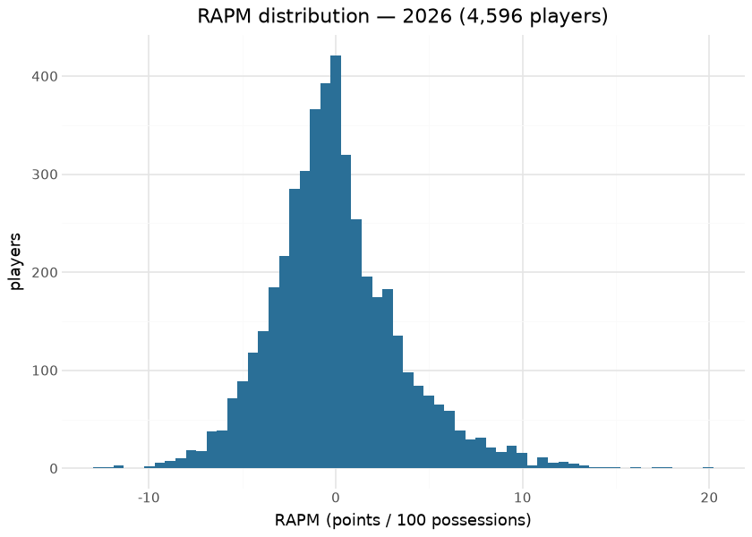
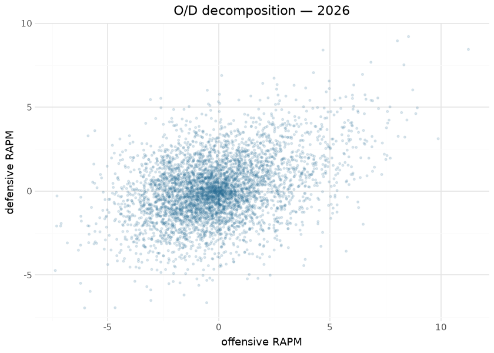
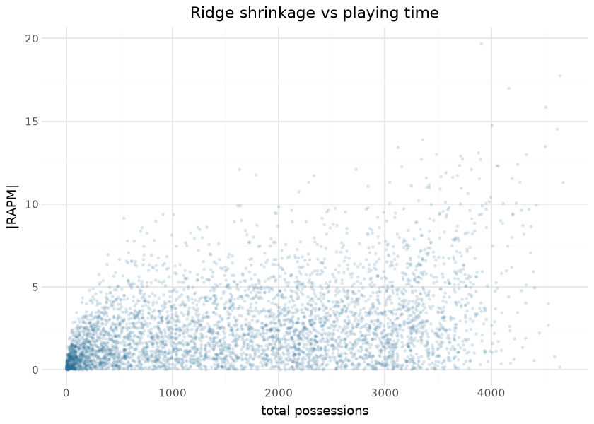
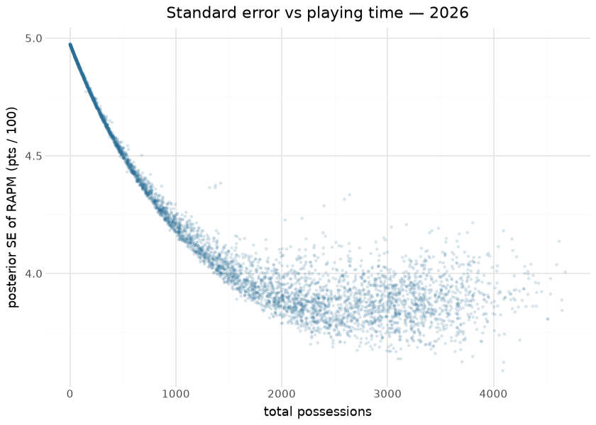
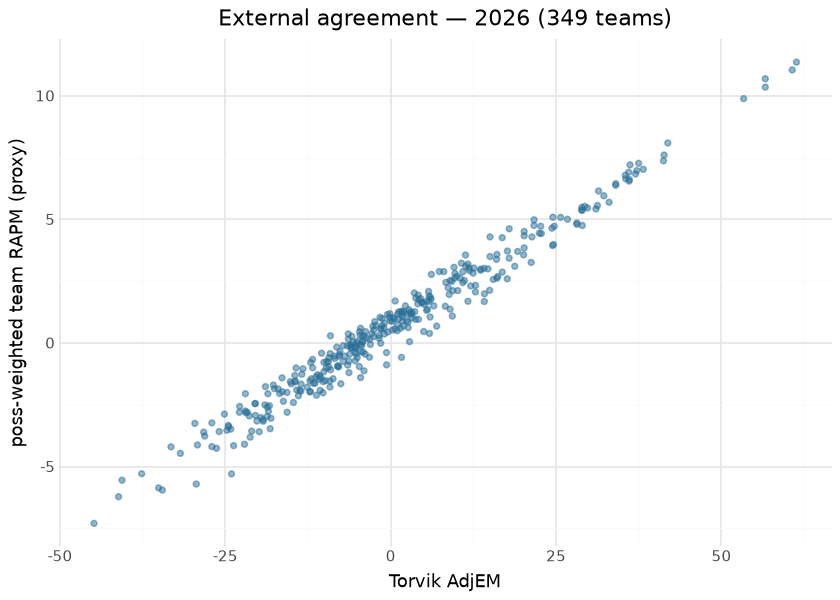

# NCAA WBB RAPM — league-wide and within-team

Two deliberately different RAPM estimands publish from this repository
on separate release tags (never merged): **league-wide**
(`ncaa_wbb_rapm`, Path B — every D-I player on one
points-per-100-possessions scale) and **within-team**
(`ncaa_wbb_rapm_within_team`, Path A — how one team’s performance
apportions across its own players; not comparable across teams by
construction). Every published row carries an `estimand` column so the
two can never be silently conflated. This document is the reproducible
writeup for the league-wide model, computed at render time from the
local sweep outputs (`ops/out_league/`), the committed evaluation card,
and the committed Torvik oracle fixture.

**Model.** Ridge regression (λ = 1000) over the possession-level on/off
design matrix: each row is a possession, each player an on/off column
(+1 offense, −1 defense), plus intercept and home-court terms. Offensive
and defensive components are estimated jointly; `rapm = orapm + drapm`
on the points-per-100 scale. The regularization strength was fixed by
the 2026-08 validation program — and the fitted value is *asserted* at
run time, because the λ no-op incident (a ridge that silently fit
unregularized) is exactly the class of bug that survives rank-based
checks.

**Uncertainty.** Every published row carries `orapm_se`, `drapm_se` and
`rapm_net_se` — the ridge **posterior** standard errors,
`sqrt(σ̂² · diag((XᵀWX + λI)⁻¹))`, with σ̂² the possession-weighted
residual variance on n − df_eff degrees of freedom (df_eff = trace of
the ridge hat matrix) and the net SE including the O/D posterior
covariance. Under the prior the penalty encodes (β ~ N(0, σ²/λ)) this is
a credible interval for the *true* impact: a low-minute player sits at ≈
0 ± σ̂/√λ (≈ ±3.6 per component) and the interval tightens as the data
separate a player from his lineups. The alternative, the frequentist
sandwich σ̂²·M(XᵀWX)M, is the *repeatability of the shrunk estimate*: it
collapses toward 0 for a player the ridge pins at zero, so it is not an
interval for the truth — but it is exactly what a refit can check, and
the producer computes it as the calibration instrument for the published
SEs (see *Uncertainty* below). The intercept is treated as fixed (its SE
is ≈ 0.14 points per 100).

**Feature engineering lives in the possession construction, not the
regression**: substitution-window stint building, possession trimming
(the usable-possession gate measures how much of a season survives),
free-throw and end-of-period edge handling, and the `name_changes`
identity bridge that keeps a player one column across transfers and name
variants. The intercept and home-court estimates double as **scale-bug
catchers** — a wrong points-per-possession normalization moves them out
of band even when the player ordering (what a Spearman gate sees)
survives.

## Training data

| League-wide RAPM corpus, by season |  |  |  |  |  |
|----|----|----|----|----|----|
| players + possessions from the local sweep outputs; usable% / intercept / HCA from the frozen evaluation card |  |  |  |  |  |
| season | players | player_poss | usable | mu | hca |
| 2011 | 4237 | 6,217,750 | 80.32 | 88.23 | 2.72 |
| 2012 | 4234 | 6,129,260 | 79.64 | 87.42 | 2.62 |
| 2013 | 4223 | 5,874,580 | 76.09 | 87.31 | 2.69 |
| 2014 | 4225 | 6,307,020 | 77.67 | 92.23 | 2.45 |
| 2015 | 4304 | 6,085,370 | 76.23 | 89.77 | 2.53 |
| 2016 | 4308 | 6,204,360 | 77.62 | 89.82 | 2.59 |
| 2017 | 4307 | 6,146,620 | 76.90 | 90.80 | 2.61 |
| 2018 | 4260 | 6,191,440 | 77.60 | 91.68 | 2.26 |
| 2019 | 4404 | 6,809,570 | 84.55 | 91.03 | 2.39 |
| 2020 | 4344 | 6,820,870 | 87.36 | 90.45 | 2.29 |
| 2021 | 4304 | 4,755,550 | 86.78 | 91.67 | 1.84 |
| 2022 | 4666 | 6,780,110 | 86.45 | 90.53 | 2.14 |
| 2023 | 4606 | 7,424,180 | 89.39 | 91.38 | 2.23 |
| 2024 | 4557 | 7,363,970 | 87.49 | 91.72 | 2.31 |
| 2025 | 4623 | 7,491,550 | 88.10 | 91.91 | 2.40 |
| 2026 | 4596 | 7,762,820 | 89.96 | 91.69 | 2.41 |

&#10;

Inputs are this repository’s own published trees: `possessions` (the
stint-level frame the NCAA hoops engine compiles from raw stats.ncaa.org
bundles), `team_rosters`, and `name_changes`. Seasons 2011–2026; 2010
exists upstream but fails the usable-possession gate and is excluded by
the gate rather than a hand list.

## Exploratory data analysis

## Attribution

There is no SHAP section here, and deliberately so: in an on/off design
the “features” are the players themselves, so the fitted coefficients
*are* the attributions — each player’s RAPM is exactly their estimated
marginal effect on a possession’s outcome, jointly with everyone else’s.
The O/D scatter above is the model’s native attribution decomposition,
and the shrinkage plot shows the prior doing the work SHAP would
otherwise reveal: low-minute players carry near-zero attributed effect
because the data cannot separate them from their lineups.

## Uncertainty

| Median posterior SE by possession decile — 2026 |  |  |  |  |
|----|----|----|----|----|
| decile 0 = fewest possessions; the prior SD σ̂/√λ is the ceiling, the collinearity floor the plateau |  |  |  |  |
| decile | n | poss_min | poss_max | median_rapm_net_se |
| 0 | 460 | 1 | 151 | 4.906 |
| 1 | 460 | 151 | 403 | 4.702 |
| 2 | 459 | 404 | 760 | 4.458 |
| 3 | 460 | 760 | 1,177 | 4.228 |
| 4 | 459 | 1,178 | 1,622 | 4.050 |
| 5 | 460 | 1,622 | 2,078 | 3.928 |
| 6 | 460 | 2,080 | 2,444 | 3.871 |
| 7 | 459 | 2,445 | 2,917 | 3.860 |
| 8 | 460 | 2,918 | 3,335 | 3.874 |
| 9 | 459 | 3,335 | 4,678 | 3.894 |

&#10;

The published SE is validated on every season by a **split-half refit**:
the season’s games are split by the parity of `contest_id`
(deterministic and roster-neutral — the halves differ by sampling noise,
not by the development or transfer drift a date split would add), both
halves are refit, and each player rated in both is checked for \|β̂ₐ −
β̂ᵦ\| ≤ 2·sqrt(SEₐ² + SEᵦ²). Under the **sampling** SE this is the
textbook calibration test and the coverage sits at the 0.954 nominal in
every season — σ̂², the inverse and the O/D covariance are right.

Under the published **posterior** SE the same test returns ≈ 1.0
coverage with a standardised-difference SD of ≈ 0.38 rather than 1.0.
Read that plainly: **the published SE is conservative by ≈ 2.5×** (≈
2.3× for 1,000-plus-possession players) relative to how much the
estimate actually moves between two halves of a season. That is not a
defect — at λ = 1000 the fit is prior-dominated, and a credible interval
for the *true* impact is legitimately wider than the *repeatability* of
a shrunk estimate — but it means the posterior coverage number is a
one-sided guard against SEs that silently shrank, never evidence of
nominal calibration.

**What to do with it.** Use `rapm_net ± 2·rapm_net_se` as a deliberately
cautious band: if it excludes zero the player is separated from the
prior by the data, and overlapping bands (as in the leaders table below)
mean a tier, not a ranking. Do NOT read it as the season-to-season or
half-to-half wobble of the number — that spread is ≈ 2.5× tighter, and a
consumer propagating the published SE into a difference-of-two-players
test will be materially over-conservative.

| Standard-error gates by season — frozen from the 2026-09-01 sweep (evaluation card) |  |  |  |  |  |  |  |  |  |
|----|----|----|----|----|----|----|----|----|----|
| split-half = odd vs even games; coverage = share of players whose other-half estimate lies within 2·sqrt(SE_A² + SE_B²); z-sd = SD of the standardised difference (1.0 when calibrated) |  |  |  |  |  |  |  |  |  |
| season | σ̂² | ρ(poss, SE) | SE dec 0 | SE dec 9 | cov (posterior) | cov O (sampling) | cov D (sampling) | cov net (sampling) | z-sd (sampling) |
| 2011 | 11,751 | −0.912 | 4.79 | 3.83 | 1.000 | 0.948 | 0.952 | 0.946 | 1.044 |
| 2012 | 11,634 | −0.910 | 4.77 | 3.83 | 1.000 | 0.949 | 0.953 | 0.951 | 1.030 |
| 2013 | 11,740 | −0.922 | 4.80 | 3.85 | 1.000 | 0.944 | 0.947 | 0.943 | 1.038 |
| 2014 | 11,944 | −0.910 | 4.84 | 3.86 | 1.000 | 0.950 | 0.951 | 0.945 | 1.050 |
| 2015 | 11,896 | −0.921 | 4.83 | 3.86 | 1.000 | 0.950 | 0.949 | 0.955 | 1.012 |
| 2016 | 11,952 | −0.917 | 4.85 | 3.87 | 1.000 | 0.951 | 0.953 | 0.943 | 1.042 |
| 2017 | 12,120 | −0.910 | 4.87 | 3.93 | 1.000 | 0.944 | 0.951 | 0.952 | 1.017 |
| 2018 | 12,165 | −0.900 | 4.88 | 3.95 | 1.000 | 0.948 | 0.944 | 0.947 | 1.047 |
| 2019 | 12,245 | −0.891 | 4.90 | 3.92 | 1.000 | 0.950 | 0.952 | 0.949 | 1.035 |
| 2020 | 12,230 | −0.872 | 4.88 | 3.95 | 1.000 | 0.950 | 0.945 | 0.945 | 1.057 |
| 2021 | 12,391 | −0.950 | 4.94 | 4.04 | 1.000 | 0.950 | 0.948 | 0.947 | 1.032 |
| 2022 | 12,215 | −0.912 | 4.89 | 3.92 | 1.000 | 0.948 | 0.956 | 0.951 | 1.013 |
| 2023 | 12,278 | −0.889 | 4.89 | 3.90 | 1.000 | 0.950 | 0.952 | 0.946 | 1.024 |
| 2024 | 12,290 | −0.892 | 4.91 | 3.90 | 1.000 | 0.943 | 0.948 | 0.942 | 1.053 |
| 2025 | 12,408 | −0.891 | 4.92 | 3.92 | 1.000 | 0.944 | 0.952 | 0.942 | 1.042 |
| 2026 | 12,382 | −0.877 | 4.91 | 3.89 | 1.000 | 0.952 | 0.947 | 0.940 | 1.043 |

&#10;

## Evaluation

Two layers, both real. First, the **frozen gates from the 2026-08-24
full validation sweep** (gates 1–4) and the **2026-09-01 standard-error
sweep** (gate 5) — publish-blocking (a failed season writes NOTHING;
floors may only be raised):

| gate | floor | observed (sweep) |
|----|----|----|
| usable-possession fraction | ≥ 0.65 | 2011+ min 0.7609 |
| intercept era band (scale-bug catcher) | \[83, 98\] | 87.31–92.80 |
| home-court advantage band | \[1.0, 4.0\] | in-band all seasons |
| σ̂² era band (SE scale-bug catcher) | \[10000, 14000\] | 11,634–12,408 |
| Spearman(possessions, rapm_net_se) | ≤ −0.80 | −0.950 to −0.872 |
| top-decile median SE \< bottom-decile median SE | strict | ratio 0.794–0.819 |
| split-half coverage, posterior SE (rapm_net) | ≥ 0.95 | ≥ 0.9995 |
| split-half coverage, sampling SE (O, D, net) | \[0.92, 0.98\] | 0.9397–0.9563 |
| Torvik external (league-wide only) | ≥ 250 joined teams AND Spearman(team_net, adjem) ≥ 0.89 | min 0.9039 (the 2021 COVID season) |

| Per-season gate results — frozen from the validation sweep (evaluation card) |  |  |  |  |  |  |
|----|----|----|----|----|----|----|
| rho = Spearman(team_net, Torvik AdjEM) on n joined teams; the possession-weighted stint aggregate the gate uses |  |  |  |  |  |  |
| season | usable | players | mu | hca | rho | n |
| 2011 | 80.32 | 4237 | 88.23 | 2.72 | <na> | <na> |
| 2012 | 79.64 | 4234 | 87.42 | 2.62 | <na> | <na> |
| 2013 | 76.09 | 4223 | 87.31 | 2.69 | <na> | <na> |
| 2014 | 77.67 | 4225 | 92.23 | 2.45 | <na> | <na> |
| 2015 | 76.23 | 4304 | 89.77 | 2.53 | <na> | <na> |
| 2016 | 77.62 | 4308 | 89.82 | 2.59 | <na> | <na> |
| 2017 | 76.90 | 4307 | 90.80 | 2.61 | <na> | <na> |
| 2018 | 77.60 | 4260 | 91.68 | 2.26 | <na> | <na> |
| 2019 | 84.55 | 4404 | 91.03 | 2.39 | <na> | <na> |
| 2020 | 87.36 | 4344 | 90.45 | 2.29 | <na> | <na> |
| 2021 | 86.78 | 4304 | 91.67 | 1.84 | 0.9039 | 326.0 |
| 2022 | 86.45 | 4666 | 90.53 | 2.14 | 0.9723 | 339.0 |
| 2023 | 89.39 | 4606 | 91.38 | 2.23 | 0.9841 | 347.0 |
| 2024 | 87.49 | 4557 | 91.72 | 2.31 | 0.9864 | 346.0 |
| 2025 | 88.10 | 4623 | 91.91 | 2.40 | 0.9800 | 349.0 |
| 2026 | 89.96 | 4596 | 91.69 | 2.41 | 0.9823 | 349.0 |

&#10;

**WBB carve-out:** seasons 2011–2020 are `UNGATED_SEASONS` for the
external gate only — Torvik has no women’s ratings before 2021. Internal
gates (usable fraction, level bands) still apply, and published rows for
those seasons carry `external_gate="ungated_no_oracle"`.

Second, a **render-time external check** against the committed Torvik
oracle fixture. The gate’s own `team_net` is a possession-weighted stint
aggregate that needs the full stint frame; this document computes the
closest player-level proxy — each team’s possession-weighted mean of
player RAPM — and holds it against Torvik AdjEM. It is labeled a proxy
precisely because it is not the gate’s aggregate; its job is to show the
external agreement reproduces from the committed artifacts alone:

| Render-time external check — possession-weighted player-RAPM proxy vs Torvik AdjEM |  |  |
|----|----|----|
| proxy aggregate (not the gate's stint-weighted team_net); computed from committed artifacts on every render |  |  |
| season | joined_teams | proxy_spearman |
| 2021 | 326 | 0.9039 |
| 2022 | 339 | 0.9723 |
| 2023 | 347 | 0.9841 |
| 2024 | 346 | 0.9864 |
| 2025 | 349 | 0.9800 |
| 2026 | 349 | 0.9823 |

&#10;

## Results

| Top 15 league-wide RAPM — 2026 (min 800 possessions) |  |  |  |  |  |  |  |  |
|----|----|----|----|----|----|----|----|----|
| points per 100 possessions; SE = posterior standard error, interval = RAPM ± 2·SE; no public headshot CDN exists for stats.ncaa.org player ids |  |  |  |  |  |  |  |  |
| Player | Team | Poss | O-RAPM | D-RAPM | RAPM | SE | 95% lo | 95% hi |
| SARAH.STRONG | UConn | 3,908 | 11.23 | 8.44 | 19.67 | 3.89 | 11.89 | 27.45 |
| MADISON.BOOKER | Texas | 4,648 | 8.53 | 9.21 | 17.74 | 3.84 | 10.06 | 25.43 |
| AZZI.FUDD | UConn | 4,166 | 8.04 | 8.95 | 16.99 | 3.91 | 9.16 | 24.82 |
| JOYCE.EDWARDS | South Carolina | 4,515 | 8.33 | 7.52 | 15.85 | 3.81 | 8.24 | 23.46 |
| GABRIELA.JAQUEZ | UCLA | 4,009 | 8.72 | 6.03 | 14.75 | 3.76 | 7.24 | 22.27 |
| HANNAH.HIDALGO | Notre Dame | 4,621 | 6.84 | 7.68 | 14.52 | 4.14 | 6.25 | 22.80 |
| MADINA.OKOT | South Carolina | 3,356 | 8.93 | 4.96 | 13.89 | 3.70 | 6.49 | 21.28 |
| JORDAN.LEE | Texas | 4,510 | 8.86 | 4.61 | 13.48 | 3.81 | 5.86 | 21.09 |
| MILAYSIA.FULWILEY | LSU | 3,123 | 6.47 | 6.95 | 13.42 | 3.64 | 6.14 | 20.69 |
| ASHLYNN.SHADE | UConn | 3,881 | 4.69 | 8.40 | 13.09 | 3.71 | 5.67 | 20.52 |
| AUBREY.GALVAN | Vanderbilt | 4,332 | 9.87 | 3.12 | 12.99 | 3.98 | 5.03 | 20.95 |
| GIANNA.KNEEPKENS | UCLA | 3,713 | 8.22 | 4.68 | 12.90 | 3.74 | 5.41 | 20.39 |
| CHARLISSE.LEGERWALKER | UCLA | 3,731 | 7.70 | 5.02 | 12.72 | 3.72 | 5.28 | 20.15 |
| RAEGAN.BEERS | Oklahoma | 3,342 | 7.15 | 5.55 | 12.70 | 3.81 | 5.07 | 20.33 |
| TESSA.JOHNSON | South Carolina | 3,899 | 8.46 | 4.23 | 12.70 | 3.75 | 5.20 | 20.19 |

&#10;

RAPM is a retrodictive on/off estimate: low-minute players shrink
heavily toward zero, multicollinearity between players who always share
the floor is resolved only by the prior, and the external Torvik gate
validates TEAM-level aggregation, not individual ordering — which is why
the results table applies a possession floor before ranking anyone. The
intervals make the point directly: the top-15 bands overlap almost
entirely, so the table is a tier, not a ranking.

## Provenance & reproducibility

- **Trained on:** this repository’s published `possessions` +
  `team_rosters` + `name_changes` trees, seasons 2011–2026 (2010
  excluded by the usable-possession gate).
- **Model:** ridge (λ = 1000, asserted at run time) via the league-blind
  sdv-py `mbb_ncaa_rapm_league` engine (WBB passes its own frames; there
  is no twin); league-wide stage
  `python/ncaa_wbb_model_01_rapm_league.py`, within-team stage
  `python/ncaa_wbb_model_02_rapm_within_team.py` (manual by design —
  needs the raw HTML bundle checkout).
- **Standard errors:** posterior `sqrt(σ̂²·diag((XᵀWX+λI)⁻¹))` from one
  dense Cholesky inverse of the (2P+1)-square penalised Gram matrix
  (≈10k, seconds); the sampling SE `σ̂²(M − λM²)` comes from the same
  inverse and drives the split-half calibration gate (gate 5). Engine:
  sdv-py `mbb_ncaa_rapm_league.solve_rapm_league` /
  `split_half_se_check`.
- **Gates:** frozen in the table above; oracle fixture
  `ops/oracle/ncaa_wbb_torvik.parquet` (a NaN rho or missing oracle
  season is a FAILURE, never a skip). Runs append `models/ledger.jsonl`;
  publish is a separate deliberate step (`ops/publish_rapm_league.py`).
- **Retrain:** `scripts/ncaa_wbb_models.sh 01` /
  `.github/workflows/ncaa_wbb_models.yml` (dispatch + annual post-season
  cron). Single home: `models/manifest.yaml`.
- **Rebuild this document:** `scripts/render_model_docs.sh` (Quarto →
  GFM; `uv sync --group docs`); reads only committed/local artifacts —
  fully offline.

## Avenues for improvement & open issues

- **Luck adjustment and archetype priors** — the two known gaps versus
  the strongest public APM systems (catalogued in the APM research
  corpus): 3P% luck-adjusting the target, and informative priors by
  player archetype instead of a flat ridge.
- **Resolved (2026-09-01, PR \#n):** exact standard errors — the ridge
  posterior SEs are published as `orapm_se` / `drapm_se` /
  `rapm_net_se`, validated by a split-half calibration gate (sampling-SE
  coverage at the 0.954 nominal in every season) and shown as ±2·SE
  intervals above. Finding worth keeping: at λ = 1000 the posterior SE
  is ≈2.3× the estimate’s repeatability even for 4,000-possession
  players — the prior, not the data, sets most of the interval.
- **Within-team CI** — Path A still requires the raw HTML bundle
  checkout; a store-backed runner would let it join the wired retrain.
- **Known issue:** multi-year RAPM (stabilizing low-minute players
  across seasons) is unbuilt; single-season estimates stay noisy below
  ~200 possessions.
